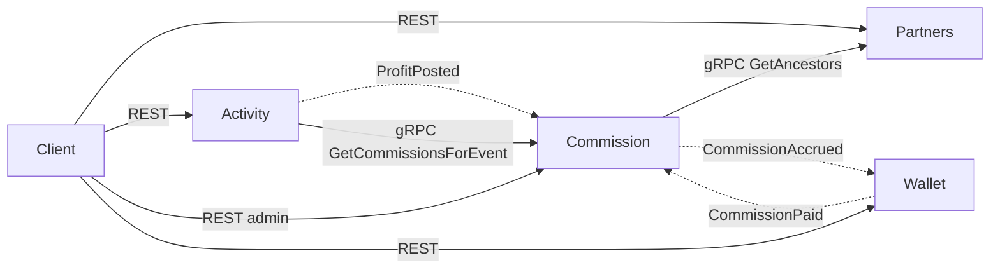

# Архитектура ACS

## Сервисы и границы

Каждый сервис хранит только те факты, которые породил сам, и не читает чужие БД. Чужие данные попадают в сервис только как проекция под его собственный сценарий чтения: например, флаг `IsPaid` в Commission обновляется по событию от Wallet.

| Сервис | Владеет | БД | Не делает |
|---|---|---|---|
| Partners | пользователь, партнёрская связь, дерево | `users` (`ltree`-путь) | комиссии, события; к брокеру не подключён |
| Activity | событие прибыли/убытка (неизменяемое) | `profit_events` + outbox | расчёт, дерево |
| Commission | схемы, активная схема, комиссии со `scheme_type` | `commissions`, `commission_scheme_settings` + inbox/outbox | дерево, кошелёк |
| Wallet | записи кошелька Pending → Paid, баланс, история | `wallet_entries` + inbox/outbox | расчёт |

## Взаимодействие

- **REST** — внешний контур.
- **gRPC** — только синхронные внутренние чтения, которые нужны немедленно: цепочка предков для расчёта и комиссии для детали события.
- **События (RabbitMQ, MassTransit)** — все изменения между сервисами. Они асинхронны и переживают недоступность получателя. Схемы событий лежат в пакете `BuildingBlocks.Contracts`.

Основной поток:

1. `POST /events` в Activity одной транзакцией сохраняет событие и, если `Profit > 0`, запись `ProfitPosted` в outbox.
2. Commission получает `ProfitPosted`, запрашивает у Partners цепочку предков, читает активную схему, рассчитывает комиссии. Одной транзакцией сохраняет их и `CommissionAccrued` по каждой.
3. Wallet создаёт по каждой комиссии запись `Pending`.
4. Фоновый `PayoutWorker` периодически переводит записи в `Paid` и в той же транзакции пишет `CommissionPaid`.
5. Commission помечает комиссию оплаченной. Баланс — сумма записей `Paid`.

## Надёжность

**Атомарность записи и публикации.** Все издатели используют EF Core transactional outbox MassTransit: событие публикуется, только если зафиксирована бизнес-запись. Распределённых транзакций нет.

**Идемпотентность (нет двойных начислений и выплат):**

| Вход | Защита |
|---|---|
| `POST /events` | PK `external_event_id`. Повтор с теми же данными — 200, с другими — 409. Гонка разрешается перехватом нарушения PK |
| `ProfitPosted` | inbox MassTransit (по `MessageId`), проверка «комиссии события уже есть», UNIQUE `(event_external_id, beneficiary_external_id)` как последний рубеж |
| `CommissionAccrued` | inbox + UNIQUE `commission_id` в Wallet |
| Выплата | `UPDATE … WHERE status = 'Pending' … FOR UPDATE SKIP LOCKED … RETURNING`: запись выплачивается ровно один раз, реплики берут непересекающиеся пакеты |
| `CommissionPaid` | условный `UPDATE … WHERE NOT is_paid`: первый `paid_at` не перезаписывается |
| `POST /users`, `PUT /parent` | естественный ключ `externalId`; повтор с тем же родителем — 200 |

**Повторы и отказы:**

- Консьюмеры используют `UseMessageRetry` с экспоненциальной задержкой. После исчерпания попыток сообщение уходит в `_error`-очередь. Ошибки, которые повтор не исправит (переполнение суммы, невалидное сообщение), идут в `_error` сразу (`NonRetryableException`).
- gRPC-клиенты используют Polly: общий таймаут, таймаут попытки, circuit breaker, параметры задаются в конфигурации. Повторы разрешены только на одной границе:
  - у клиента Commission → Partners `RetryAttempts = 0`: повторяет сообщение, а не вызов;
  - у Activity → Commission повторяет сам клиент, потому что вызов синхронный внутри REST-запроса.
- Если Partners недоступен, начисление откладывается: сообщение повторяется и обрабатывается после восстановления. Если недоступен Commission, деталь события отвечает 503 (комиссии не отдаются частично), а приём событий продолжает работать.
- Если брокер недоступен, приём событий и выплаты продолжаются: сообщения копятся в outbox и доставляются после восстановления.

**Graceful shutdown.** Используется штатный хост ASP.NET Core (`ShutdownTimeout` 30 с, `stop_grace_period` 30 с в compose):

- MassTransit дожидается текущих сообщений;
- `PayoutWorker` завершает или откатывает текущий пакет и не начинает новый;
- незавершённые транзакции откатываются, и брокер доставит сообщения заново.

**Миграции** применяются при старте под `pg_advisory_lock`, поэтому несколько реплик не мешают друг другу. Пока БД стартует, применение повторяется.

## Данные

- **Partners:** `users(external_id PK, parent_external_id FK, path ltree)`, индекс GiST по `path`.
  - Предки берутся из пути без дополнительных запросов.
  - Потомки выбираются через `path <@ …`.
  - Смена родителя переписывает поддерево одним `UPDATE` в транзакции.
  - Мутации дерева сериализуются `pg_advisory_xact_lock`: это исключает цикл из двух параллельных перемещений.
- **Commission:** каждая комиссия хранит `scheme_type` (неизменяемо), `level`, `amount numeric(18,4)`, `is_paid`/`paid_at`. Активная схема — одна строка настроек; при каждом расчёте она читается из БД, поэтому переключение сразу видно всем репликам.
- **Wallet:** `wallet_entries(status Pending|Paid)`. Два частичных индекса: для выбора пакета выплаты и для баланса/истории (с `INCLUDE (amount)`).

## Решения

| Решение | Почему |
|---|---|
| 4 сервиса по границам владения данными | каждый сервис — единственный писатель своей БД; сервисы масштабируются и отказывают независимо |
| Дерево на Postgres `ltree` | предки за O(1) по PK, потомки по индексу, перенос поддерева одним запросом, нет рекурсии и лимита глубины |
| gRPC только для чтений, изменения — событиями | чтения нужны сразу, изменения должны переживать недоступность получателя |
| Transactional outbox вместо 2PC | атомарность записи и публикации; прямо разрешено допущениями ТЗ |
| Идемпотентность через ограничения БД + inbox | не нужна отдельная инфраструктура дедупликации; работает при конкурирующих консьюмерах |
| Схемы — Strategy (`ICommissionScheme`) + реестр из DI | третья схема добавляется одним классом и одной регистрацией; тип хранится строкой |
| Расчёт на `decimal`, округление до 4 знаков «от нуля» в одном месте | точные деньги, воспроизводимые тесты; переполнение отправляет сообщение в `_error`, повтор не нужен |
| Баланс считается по записям `Paid`, отдельной таблицы нет | баланс не может разойтись с историей |
| `ServiceDefaults` — общая библиотека | логи, трейсинг, метрики, health, ошибки и обвязка MassTransit одинаковы во всех сервисах |
| Contracts — NuGet-пакет из локального feed | издатель и потребители делят одну версию схемы событий |

## Масштабирование

- Все сервисы stateless, всё состояние — в Postgres.
- REST и gRPC масштабируются репликами за балансировщиком.
- Консьюмеры — competing consumers; дубли безопасны благодаря идемпотентности.
- Выплату можно запускать на нескольких репликах: `SKIP LOCKED` раздаёт им непересекающиеся пакеты.
- Узкие места и способы их снять:
  - вызов Partners на каждое событие — реплики или кэш цепочек;
  - глубокая пагинация — keyset;
  - рост таблиц — партиционирование по времени.

## Упрощения и что не сделано

- Application-слой работает с `DbContext` напрямую, без отдельных репозиториев. Исключение — Partners: там есть порты `IUserRepository` и `ITreeMutationScope`, и use case'ы тестируются на фейках. Внешние сервисы везде скрыты за портами (`IAncestorsProvider`, `ICommissionsReader`).
- Автотесты — unit. Сквозной сценарий покрыт скриптом `scripts/smoke-test.sh` поверх docker-compose. Интеграционных тестов на Testcontainers нет.
- Нет аутентификации: предполагается API Gateway.
- Нет UI для `_error`-очередей: сообщения возвращаются в работу вручную через RabbitMQ management.
