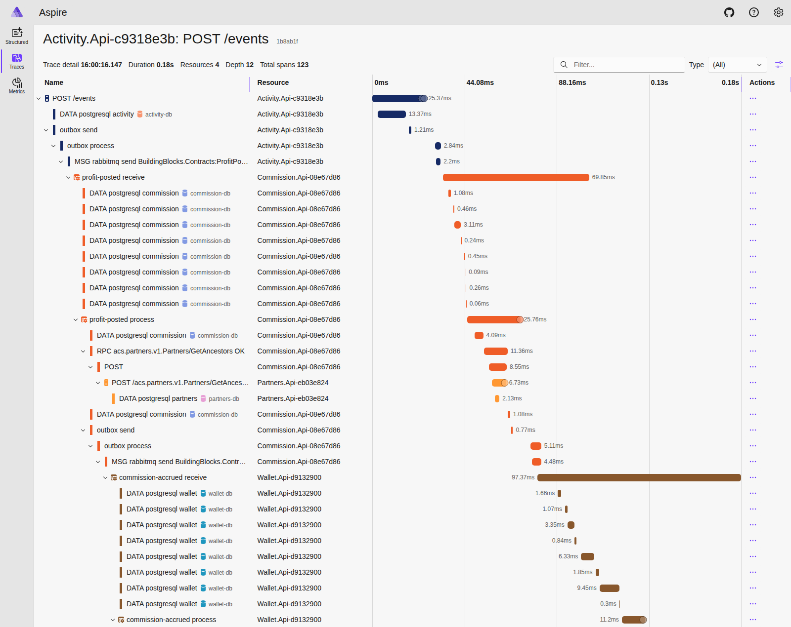

# ACS — система партнёрских отчислений

Микросервисы на .NET 8, которые начисляют партнёрские комиссии по цепочке пользователей и периодически выплачивают их на кошелёк.

| Сервис | Отвечает за | REST |
|---|---|---|
| [Partners](src/Services/Partners/README.md) | пользователи и дерево партнёров | `localhost:5101` |
| [Activity](src/Services/Activity/README.md) | приём и просмотр событий прибыли/убытка | `localhost:5102` |
| [Commission](src/Services/Commission/README.md) | схемы Linear/Fibonacci, расчёт комиссий | `localhost:5103` |
| [Wallet](src/Services/Wallet/README.md) | накопление, выплата, баланс, история | `localhost:5104` |

У каждого сервиса своя БД Postgres. Изменения между сервисами идут событиями через RabbitMQ (MassTransit + transactional outbox), синхронные чтения — через gRPC. API, сообщения и настройки каждого сервиса описаны в его README; устройство системы и принятые решения — в [ARCHITECTURE.md](ARCHITECTURE.md).

## Запуск

Нужен Docker (Compose v2).

```bash
docker compose up --build -d
docker compose ps    # дождитесь, пока все контейнеры станут healthy
```

Сквозная проверка строит цепочку пользователей и проверяет обе схемы, переключение схемы без пересчёта старых комиссий, идемпотентность, отсутствие комиссий за убыток, выплату и баланс:

```bash
./scripts/smoke-test.sh                                            # bash + curl + python
powershell -ExecutionPolicy Bypass -File scripts\smoke-test.ps1    # Windows
```

Пример вручную:

```bash
curl -X POST localhost:5101/users -H 'Content-Type: application/json' -d '{"externalId":"alice"}'
curl -X POST localhost:5101/users -H 'Content-Type: application/json' -d '{"externalId":"bob","parentExternalId":"alice"}'
curl -X POST localhost:5101/users -H 'Content-Type: application/json' -d '{"externalId":"carol","parentExternalId":"bob"}'

curl -X POST localhost:5102/events -H 'Content-Type: application/json' \
  -d '{"externalEventId":"ev-1","userExternalId":"carol","profit":200}'

curl localhost:5102/events/ev-1          # Linear: bob — 2 (L1), alice — 4 (L2)
sleep 20                                 # выплата в compose — раз в 15 секунд
curl localhost:5104/users/alice/balance  # 4
```

Наружу публикуются только REST сервисов, RabbitMQ и дашборд; базы данных и gRPC доступны лишь внутри сети compose.

## Наблюдаемость

| Что | Где |
|---|---|
| Aspire Dashboard — трейсы, логи, метрики | http://localhost:18888 |
| RabbitMQ management (`guest` / `guest`) | http://localhost:15672 |
| Health каждого сервиса | `/health/live`, `/health/ready` |
| Метрики в формате Prometheus | `/metrics` |

Aspire Dashboard — отдельный контейнер в compose, только UI телеметрии. Сервисы отправляют в него данные по OpenTelemetry (OTLP, переменная `OTEL_EXPORTER_OTLP_ENDPOINT`):

- **Traces** — путь события одной цепочкой через все сервисы: REST → outbox → RabbitMQ → gRPC → БД. Фоновый опрос outbox в трейсы не попадает.
- **Structured logs** — логи всех сервисов с фильтром по сервису, уровню и trace id; из лога можно перейти в его трейс.
- **Metrics** — HTTP, gRPC, MassTransit, .NET runtime, счётчики выплат Wallet.

Трейс события из примера выше (**Traces** → `Activity.Api: POST /events`):



Телеметрия хранится в памяти контейнера и пропадает при его перезапуске; дашборд открыт без входа — только для локального запуска.

## Разработка

Нужен .NET SDK 8. Сервисы подключают `BuildingBlocks.Contracts` пакетом из локального feed, поэтому перед первой сборкой его нужно собрать:

```bash
./scripts/pack-contracts.sh    # Windows: scripts\pack-contracts.ps1
dotnet build ACS.sln
dotnet test ACS.sln
```

Unit-тесты покрывают расчёт комиссий по обеим схемам, дерево партнёров и доменные правила сервисов. Миграции EF Core применяются при старте. Для запуска сервиса вне Docker есть `appsettings.Development.json` (Postgres на `localhost:5433`, RabbitMQ на `localhost:5672`).

```text
src/BuildingBlocks/Contracts         события ProfitPosted, CommissionAccrued, CommissionPaid
src/BuildingBlocks/ServiceDefaults   логи, телеметрия, health, ошибки, MassTransit + outbox, миграции
src/Services/<Service>               сервис (Domain / Application / Infrastructure / Api) и его README
protos/                              gRPC-контракты
tests/                               unit-тесты
scripts/                             упаковка контрактов, сквозная проверка
```

## Допущения

- Событие содержит id владельца, id события и `Profit`; время приёма ставит сервис.
- Партнёра можно сменить; начисленные комиссии при смене партнёра или схемы не пересчитываются.
- Схема применяется в момент расчёта комиссии и записывается в каждую комиссию.
- Глубина дерева не ограничена (Postgres `ltree`), хотя ТЗ допускает лимит в 10 уровней.
- Суммы — `numeric(18,4)`.
- Аутентификация и авторизация — на стороне API Gateway, вне объёма решения.
